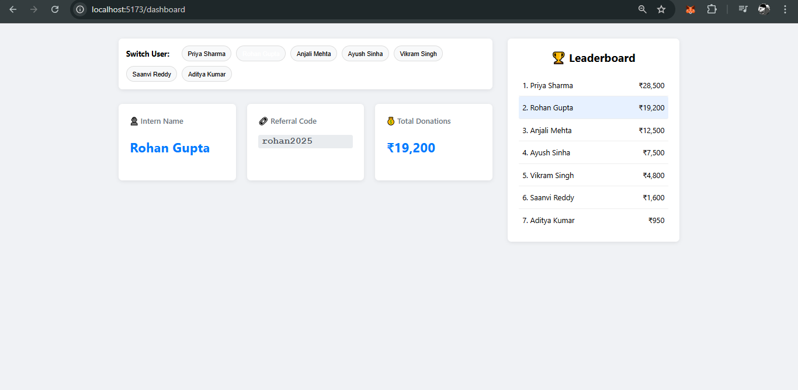

# 🎯 Intern Fundraising Dashboard

A simple, clean, and responsive dashboard built with the **MERN stack** (MongoDB, Express, React, Node.js) to track and display fundraising progress for interns.  
The frontend is built using **Vite + React**, and the backend is powered by **Node.js** and **Express**.

---

## 📸 Screenshot

> Replace the placeholder below with your actual screenshot.



---

## ✨ Features

- **Dynamic User Switching** – Seamlessly switch between intern profiles with a single click.  
- **Live Data Fetching** – All data is fetched from a backend API.  
- **Responsive Sidebar Leaderboard** – Always-visible, ranked leaderboard that updates in real time.  
- **Highlighted Current User** – Easily identify the currently viewed intern in the list and leaderboard.  
- **Clean, Modern UI** – A two-column, professional layout using modern CSS.  
- **Database Ready** – Backend code is prepared for MongoDB integration (commented for easy activation).

---

## 🛠️ Tech Stack

### Frontend
- [React](https://reactjs.org/) (Vite)
- CSS Modules

### Backend
- [Node.js](https://nodejs.org/)
- [Express](https://expressjs.com/)

### Database (Optional)
- [MongoDB](https://www.mongodb.com/)
- [Mongoose](https://mongoosejs.com/)

---

## 📋 Prerequisites

Ensure you have the following installed:

- **Node.js** (v14 or later)
- **npm** (comes with Node.js)
- **MongoDB** (only if you plan to use the database)

---

## 🚀 Installation and Setup

### 1. Clone the Repository

```bash
git clone <your-repository-link>
cd <your-project-directory>
```

### 2. Backend Setup
```bash
# Go to the backend folder
cd backend

# Install backend dependencies
npm install

# Start the backend server
node server.js
```

### 3. Frontend Setup
```bash
# Go to the frontend folder from the root
cd ../frontend

# Install frontend dependencies
npm install

# Start the frontend development server
npm run dev
```
##  🔮 Future Improvements
-Full Authentication: Add login and signup using JWT or sessions.

-Database Integration: Uncomment MongoDB code in backend/server.jsx to use a real database.

-Add Donation Endpoint: Add a /api/donate endpoint using MongoDB’s $inc to update donation amounts.

-User Profile Page: Let interns update their personal info.

-Admin Panel: Create a dashboard for admins to manage interns and donations.
